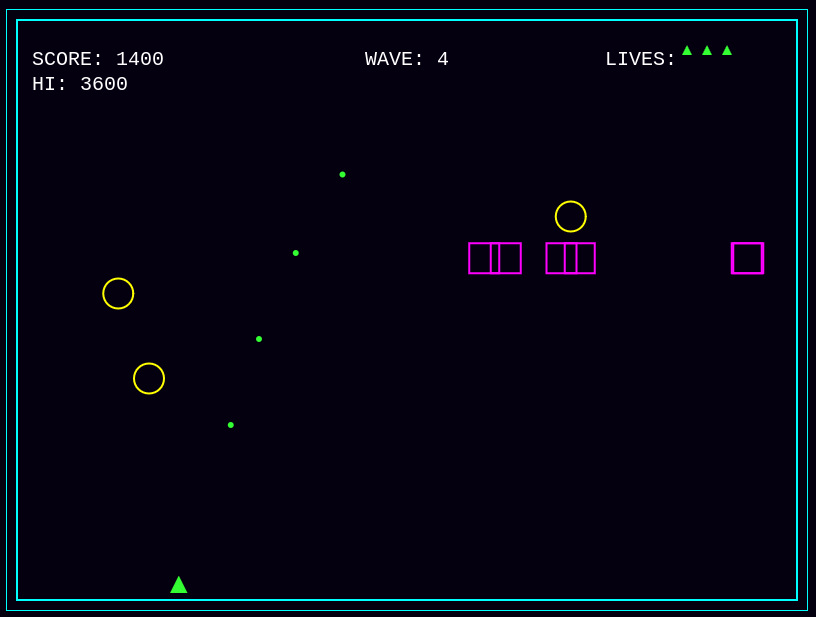

# Vector Vanguard


<!-- Replace vector_vanguard_screenshot.gif with an actual URL to a screenshot or GIF -->
<!-- Example: Gameplay recording using tools like LICEcap, ScreenToGif, or Kap -->

A fast-paced, retro-inspired top-down arena shooter built entirely with **vanilla HTML, CSS, and JavaScript (ES6+)**. No external libraries, frameworks, or APIs were used, relying solely on the HTML5 Canvas API for rendering and the Web Audio API for sound.

Survive increasingly challenging waves of geometric enemies, master precise controls, and chase the high score in this minimalist vector-style arcade experience.

## Features

*   **Core Gameplay:**
    *   8-Directional Player Movement (WASD / Arrow Keys)
    *   Mouse Aiming & Left-Click Shooting
    *   Progressive Wave System with increasing enemy counts/types
*   **Enemies:**
    *   Basic 'Square' enemies (downward movement, wrap-around)
    *   Basic 'Circle' enemies (diagonal movement, wrap-around)
*   **Interaction:**
    *   Collision Detection: Projectile-Enemy & Enemy-Player
    *   Projectile removal on hit or off-screen
    *   Enemy removal on hit
*   **Scoring & State:**
    *   Score tracking (points per enemy kill)
    *   Lives system (player loses life on hit)
    *   High Score persistence via `localStorage`
    *   Game States: Main Menu, Playing, Game Over
    *   Restart functionality (from Game Over or Menu via Enter/Click)
*   **Visuals:**
    *   Minimalist Vector Graphics style via HTML5 Canvas
    *   Particle Effects on enemy destruction
    *   Screen Shake effect on player hit
*   **Audio:**
    *   Sound Effects (Shoot, Enemy Hit, Player Hit) via Web Audio API
    *   Looping Background Music via HTML `<audio>` tag

## Technology Stack

*   **HTML5:** Structure and Canvas element (`<canvas>`, `<audio>`).
*   **CSS3:** Basic styling and layout (centering the canvas).
*   **JavaScript (ES6+):** All game logic, rendering, physics, state management, input handling.
    *   **HTML5 Canvas API (2D Context):** Used for all rendering.
    *   **Web Audio API:** Used for loading and playing sound effects.
    *   **`localStorage` API:** Used for high score persistence.
*   **Constraint:** No external libraries or game frameworks (e.g., Phaser, PixiJS, Three.js) were used.

## Getting Started

1.  **Clone the repository:**
    ```bash
    git clone https://github.com/PSthelyBlog/vector-vanguard.git
    cd vector-vanguard
    ```
2.  **Run locally:**
    *   **Option A (Simple):** Open the `index.html` file directly in a modern web browser that supports HTML5 Canvas and Web Audio API (Chrome, Firefox, Edge, Safari).
        *   *Note:* Running directly via `file:///` might sometimes restrict audio playback initiation (due to browser security/autoplay policies) or `localStorage` access in certain scenarios.
    *   **Option B (Recommended):** Use a simple local web server for the best experience (ensures audio/localStorage work as expected).
        *   If you have Node.js installed:
            ```bash
            npx http-server .
            ```
            Then open `http://localhost:8080` (or the address shown) in your browser.
        *   If you have Python 3 installed:
            ```bash
            python -m http.server
            ```
            Then open `http://localhost:8000` in your browser.

## How to Play

*   **Move:** Use `WASD` keys or the `Arrow Keys`.
*   **Aim:** Move your `Mouse`.
*   **Shoot:** `Left Mouse Click`.
*   **Objective:** Destroy all enemies in each wave to progress. Survive as long as possible and achieve the highest score.
*   **Start/Restart:** Click or Press `Enter` on the Menu or Game Over screen.

## Development

This project was built incrementally following a step-by-step plan as a demonstration of vanilla JavaScript game development techniques. Each major feature (movement, shooting, enemies, waves, UI, effects, state) corresponds roughly to a step in the plan.

## Future Improvements / Ideas

*   More enemy types with diverse movement patterns and attacks (e.g., homing, shooting).
*   Player power-ups (e.g., spread shot, shield, rapid fire).
*   Boss battles at the end of certain waves.
*   More sophisticated particle effects and visual feedback.
*   Refined audio design and more sound variety.
*   Difficulty scaling beyond just enemy counts.
*   Touch controls for potential mobile play (would require significant input changes).
*   Online leaderboard integration (would require external services/API).

<!-- ## License -->

<!-- Choose and specify a license. MIT is common for open source projects. -->

## Acknowledgements

*   Inspired by classic arcade games like Asteroids and Geometry Wars.
*   Sound Effects by "A Dev's Diary": https://opengameart.org/content/wolfclone-sound-pack
*   Background music by "pbondoer": https://opengameart.org/content/a-journey-awaits